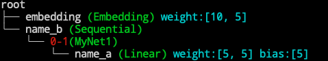
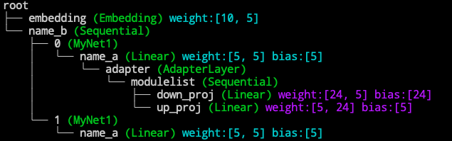

(keyfeature)=
# Philosophy and Key Features

:::{admonition} Philosophy of the design.
:class: tip

Existing open-source project to propogate this **``delta-tuning''** paradigm includes
<a href="https://adapterhub.ml">AdapterHub</a>, which copies the transformers code base and modify on it, which makes it unintuitive to transfer from a normal code base to a delta-tuning ones.

OpenDelta approaches this problem via a true plug-and-play fashion to the PLMs. To migrate from a full-model finetuning training scripts to a delta tuning training scripts, you **DO NOT**  need to change the backbone bone model code base. 
:::

## How we achieve "No backbone code modification"?

The key advantage of OpenDelta is **NO backbone modification**, thus are easy for migrating, and adaptation. Here is how we achieve it.

**Read through it will also help you to implement your own delta models.**

### 1. Name-based submodule addressing.
We locate the submodules that we want to apply a delta layer via name-based addressing.

In pytorch fashion, a submodule can be accessed from a root model via 'dot' addressing. For example, we define a toy language model

```python
import torch.nn as nn
class MyNet1(nn.Module):
    def __init__(self,):
        super().__init__()
        self.name_a = nn.Linear(5,5)
    def forward(self, hiddens):
        return self.name_a(hiddens)

class MyNet2(nn.Module):
    def __init__(self,):
        super().__init__()
        self.embedding = nn.Embedding(10,5)
        self.name_b = nn.Sequential(MyNet1(), MyNet1())
    def forward(self, input_ids):
        hiddens = self.embedding(input_ids)
        return self.name_b(hiddens)
        
root = MyNet2()
print(root.name_b[0].name_a)
# Linear(in_features=5, out_features=5, bias=True)
```

We can visualize the model (For details, see [visualization](visualization))

```python
from opendelta import Visualization
Visualization(root).structure_graph()
```


In this case, string `"name_b.0.name_a"` will be the name to address the submodule from the root model. 

Thus when applying a delta model to this toy net.

```
from opendelta import AdapterModel
AdapterModel(backbone_model=root, modified_modules=['name_b.0.name_a'])
Visualization(root).structure_graph()
```


For more about name-based addressing syntax and shortcuts, see [basics](basics).

### 2. Three basic submodule-level delta operations.
We use three key functions to achieve the modifications to the backbone model outside the backbone model's code.

1. **unfreeze some paramters**

   Some delta models will unfreeze a part of the model parameters and freeze other parts of the model, e.g. [BitFit](https://arxiv.org/abs/2106.10199). For these methods, just use [freeze_module](opendelta.basemodel.DeltaBase.freeze_module) method and pass the delta parts into :string:`exclude`.
   
2. **replace an module**

   Some delta models will replace a part of the model with a delta model, i.e., the hidden states will no longer go through the original submodules. This includes [Lora](https://arxiv.org/abs/2106.09685).
   For these methods, we have an [update_module](opendelta.basemodel.DeltaBase.replace_module) interface.

3. **insertion to the backbone**

   - **sequential insertion**
   
    Most adapter model insert a new adapter layer after/before the original transformers blocks. For these methods, insert the adapter's forward function after/before the original layer's forward function using [insert_sequential_module](opendelta.basemodel.DeltaBase.insert_sequential_module) interface. 
   - **parallel insertion**
   
    Adapters can also be used in a parallel fashion (see [Paper](some)).
    For these methods, use [insert_parallel_module](opendelta.basemodel.DeltaBase.insert_parrellel_module) interface.


:::{admonition} Doc-preserving Insertion
:class: note
In the insertion operations, the replaced forward function will inherit the doc strings of the original functions. 
:::

### 3. Pseudo input to initialize.
Some delta models, especially the ones that is newly introduced into the backbone, will need to determine the parameters' shape. To get the shape, we pass a pseudo input to the backbone model and determine the shape of each delta layer according to the need of smooth tensor flow. 

:::{admonition} Pseudo Input
:class: warning
We assume the pseudo input to the model is something like `input_id`, i.e., an integer tensor 
```python
pseudo_input = torch.tensor([[0,0,0]])
# or 
pseudo_input = torch.tensor([0,0,0])
```
We will add interface to allow more pseudo input soon.
:::


