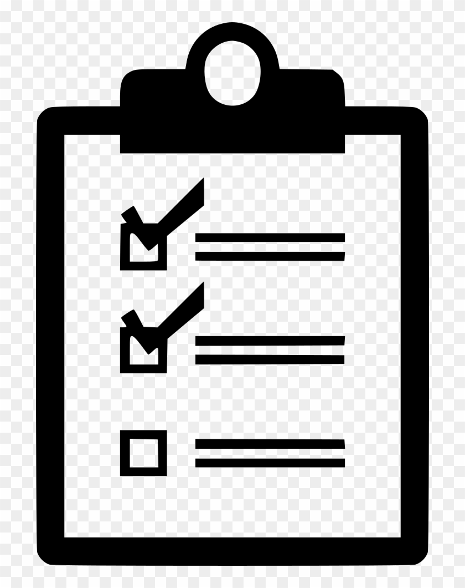

# What is Delta-tuning and Why OpenDelta?

:::{admonition} What is Delta?
:class: tip

As Pre-trained language models (PLMs) have become the fundamental infrastructure on many NLP tasks and benchmarks, it is becoming increasingly clear from recent research that **larger models tend to lead to better performance**. However, large-scale PLMs also bring prohibitive adaptation costs when fine-tuning all the parameters of a model and retaining separate instances for different tasks.

**Parameter-efficient model stimulation methods** thus have attracted researchers' eyes, which only tune a small fraction of model parameter while achieving comparable or even better performance than full-model fine-tuning, dubbed as "Delta-tuning".

**Delta** thus means a small fraction $\Delta\Theta$  of parameters besides the pretrained models $\Theta_0$. 

\begin{gather*}
\Theta \sim \Theta_0\text{(frozen)} + \Delta\Theta\text{(tunable)}
\end{gather*}

This open-source project implement several delta-tuning methods, which allows researchers and engineers to quickly migrate their codes from full-model tuning to delta-tuning without replace the backend (the implementation of the backbone PLM).
:::

## Why OpenDelta?

1. Clean: No need to edit the backbone PTM’s codes.
2. Sustainable: Most evolution in external library doesn’t require a new OpenDelta.
3. Extendable: Various PTMs can share the same PET codes.
4. Simple: Applying Deltas to Huggingface examples needs as little as 2 lines of codes.
5. Flexible: Able to apply PETs to (almost) any position of the PTMs.

## Comparison with AdapterHub

## Delta-tuning papers

