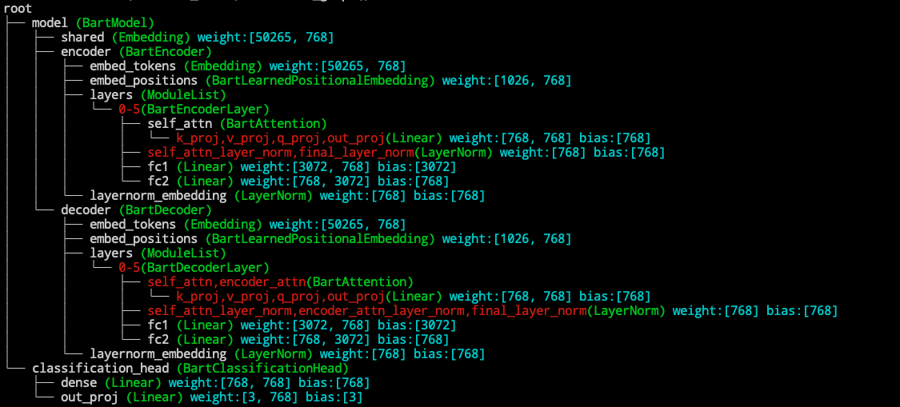

(basics)=
# Basic Usage and Workflow
Now we introduce the general pipeline to migrate your full-model tuning scripts to a delta tuning one. 

### STEP 1: Load the pretrained models

```python
from transformers import AutoModelForSequenceClassification
model = AutoModelForSequenceClassification.from_pretrained("facebook/bart-base")
```

Suppose we want to apply an adapter to the feedforward layer of each block,
We should first know what is the name of the feedforward layer in the Bart model.

```python
from opendelta import Visualization
Visualization(model).structure_graph()
```




 *For more about visualization, see [Visualization](visualization).*

### STEP 2: Add delta modules

We can see from the structure graph that the feed forward layer in Bart is called `model.encoder.layers.$.fc1` and `model.encoder.layers.$.fc2`, where
`$` represent a number from 0-5.  Since we want to apply adapter after the feed forward layer, we specify the `modified_modules=['fc2']`

  *for details about the name based addressing, see [Name-based submodule addressing](namebasedaddr)*

Other configurations, such as the `bottleneck_dim` in Adapter, can be passed as key word arguments.
```python
from opendelta import AdapterModel
delta_model = AdapterModel(backbone_model=model, modified_modules=['fc2'], bottleneck_dim=12)
```

:::{admonition} Delta model vs Backbone model
:class: note
The delta_model **CAN NOT**  be used alone, and its [forward](opendelta.basemodel.DeltaBase.forward) is canceled. The training pipeline should be conducted on the backbone model (In this example, its the `model`).
:::

:::{admonition} Try different positions
:class: note
OpenDelta provide the flexibility to add delta to different positions on the backbone model. For example, If you want to move the adapter in the above example after the layer norm of the feed forward layer. The code should be changed into
```python
delta_model = AdapterModel(backbone_model=model, modified_modules=['final_layer_norm'], bottleneck_dim=12)
```
The performance may vary due to positional differences, but there is no academic guarantee that one will outperform the other.
:::
### STEP 3: Freezing parameters
The main part of the backbone model is not automatically frozen (We may add the option in future). To freeze the main part of the backbone model except the trainable parts (usually the delta paramters), use [freeze_module](opendelta.basemodel.DeltaBase.freeze_module) method. The `exclude` field obeys the same name-based addressing rules as the `modified_modules` field.

```python
delta_model.freeze_module(exclude=["deltas", "layernorm_embedding"], set_state_dict=True)
```
The `set_state_dict=True`  will tell the method to change the `state_dict` of the `backbone_model` to maintaining only the trainable parts. 


### STEP 4: Normal training pipeline

The **model** then can be trained in traditional training scripts. Two things should be noticed:
1. No need to change the optimizer, since the optimizer will only calculated and store gradient for those parameters with `requires_grad=True`, and the `requires_grad` attribute has been changed during the call to [freeze_module](opendelta.basemodel.DeltaBase.freeze_module) method.
2. `model.eval()` or `model.train()` should be used when needed to set dropout, etc. Delta model doesn't touch those configuration.

### STEP 5: Saved/Share the Delta Model

 *see [Save a delta model to local, or share with the community](saveload).*


